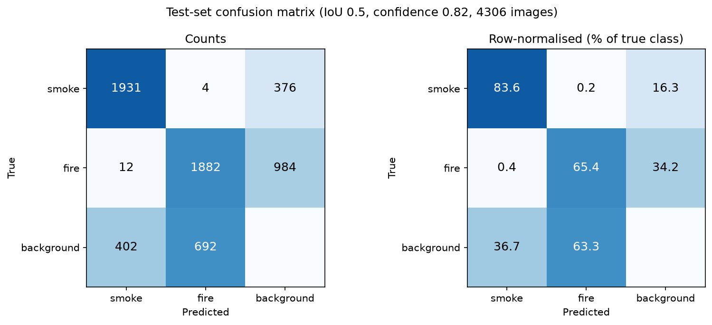
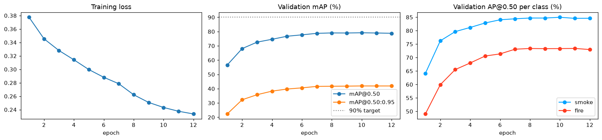
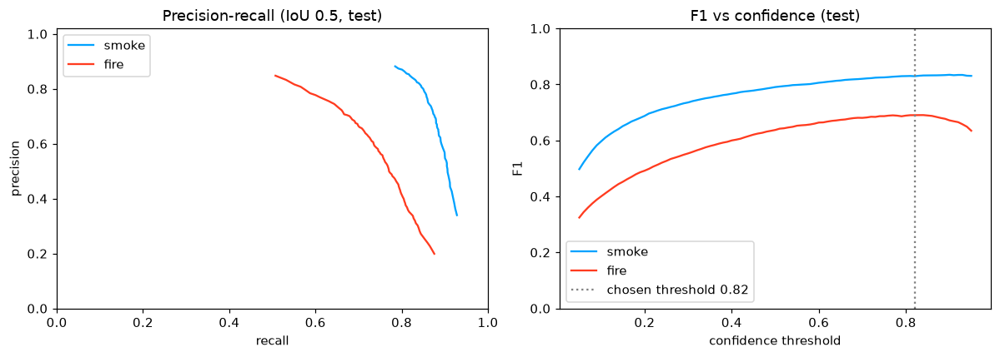
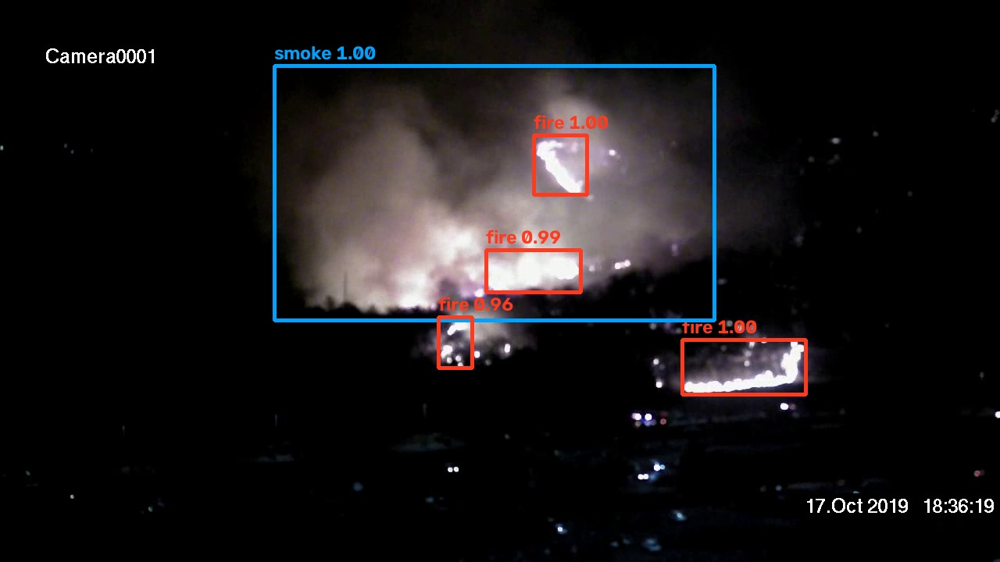

# Forest fire and smoke detection with a Vision Transformer

A ViTDet-style Faster R-CNN (ViT-B backbone + simple feature pyramid) that detects **smoke** and **fire**
with bounding boxes. Trained and evaluated on the D-Fire dataset
(Kaggle: `sayedgamal99/smoke-fire-detection-yolo`).

**Headline result:** 78.07% mAP@0.50 on the test set (4,306 images). The project target was 90%, so this run is
11.93 points short. It is a single training run with one random seed.

## Results

Test set, confidence threshold 0.82, NMS IoU 0.5, match IoU 0.5 (thresholds tuned on validation only):

| Class | Precision | Recall | F1 | AP@50 | AP@50:95 |
|---|---|---|---|---|---|
| Smoke | 82.35 | 83.56 | 82.95 | 85.33 | 48.12 |
| Fire | 73.04 | 65.43 | 69.02 | 70.81 | 34.32 |
| **Overall** | 77.69 | 74.49 | 75.99 | **78.07** | 41.22 |

Validation mAP@0.50 of the selected checkpoint (epoch 10): 79.15%.

### Confusion matrix (test set)



Detections are matched to ground truth one-to-one by IoU >= 0.5. Class mix-ups are almost nonexistent
(4 smoke boxes labelled fire, 12 fire boxes labelled smoke). The weakness is missed fire: 984 of 2,878 fire
boxes (34.2%) got no detection, against 16.3% of smoke.

### Training curves and precision-recall




Validation mAP@0.50 rose from 56.6 (epoch 1) to about 79 by epoch 8 and then stayed flat while the training loss
kept falling, so more epochs of the same setup would add little.

### Where it fails

- Fire recall is 52.5% on small objects against 80.6% on large ones (smoke: 67.6% small, 90.5% large).
- 478 fire and 266 smoke detections had the right class but IoU only 0.1-0.5 (poor localisation).
- Only 27 of 2,005 empty test images (1.3%) produced a false alarm.
- Fire boxes are tiny (median about 0.54% of the image area vs 14% for smoke) and images are shrunk to 640x384.

## Method

- **Backbone:** plain ViT-B (patch 16, `augreg` ImageNet-21k weights fine-tuned on ImageNet-1k, via `timm`),
  fine-tuned end to end.
- **Neck:** ViTDet-style simple feature pyramid built from the single stride-16 map (strides 4, 8, 16, 32, plus one
  pooled level for the RPN).
- **Head:** Faster R-CNN (RPN + RoIAlign + box head) from `torchvision`. Anchor sizes (4 and 6 x stride, aspect
  ratios 0.5/1/2) were chosen from the training-box statistics.
- **Data handling:** labels converted from YOLO format; out-of-range boxes clipped, degenerate boxes and duplicates
  removed. About 45% of images are empty and kept as negatives. Images are letterboxed to 640x384.
- **Augmentation:** horizontal flip, random scale/translate, brightness/contrast, mild hue/saturation, blur, noise.
- **Optimisation:** AdamW (weight decay 0.05), layer-wise LR decay 0.8, warm-up + cosine schedule, fp16 mixed
  precision, EMA weights (decay 0.999), batch size 8, best checkpoint by validation mAP@0.50.

### Model selection (3-epoch runs on a 2,000-image subset, validation mAP@50)

| Configuration | mAP@50 |
|---|---|
| **ViT-B, 640x384** | **49.61** |
| ViT-S, 640x384 | 45.07 |
| ViT-S, 832x480 | 43.05 |
| ViT-S, no stride-4 level | 38.82 |
| ViT-S, first 6 blocks frozen | 38.62 |

Recipe variants on ViT-B: lr 2e-4 = 50.68 (selected), lr 1e-4 = 49.61, all negatives every epoch = 49.41.
These are short runs that only rank configurations; the recipe differences are within about 1.3 points.

## Repository contents

| Path | What it is |
|---|---|
| `forest_fire_vit_detection.ipynb` | The full pipeline: data, model, training, evaluation, error analysis |
| `run_notebook.py` | Runs the notebook headlessly and logs progress per cell |
| `predict.py` | Standalone inference: run the final model on an image (see below) |
| `outputs/forest_fire_detection_best.pth` | Final model (Git LFS, about 424 MB): weights, config, tuned thresholds |
| `outputs/` | Plots and `final_results.json` |
| `deliverables/forest_fire_vit_detection_full_code_and_explanation.txt` | All code with explanations in one text file |
| `deliverables/forest_fire_vit_paper.tex` | Draft IEEE-format paper (author block and references need checking) |
| `deliverables/make_confusion_matrix.py` | Code that builds the test-set confusion matrix from the saved model (`python deliverables/make_confusion_matrix.py`, about 3 min; needs the data) |
| `run_outputs/` | Training log and the executed notebook |

Not included: the D-Fire dataset (about 3 GB) and the resumable training state `last_checkpoint.pth` (1.7 GB).

## Reproduce

1. Install: `torch`, `torchvision`, `timm>=1.0`, `albumentations`, `pycocotools`, `opencv-python`, `pandas`,
   `matplotlib`, `tqdm`, `nbclient`.
2. Download D-Fire and set the environment variable `DATA_ROOT` to the folder containing `train/`, `val/`, `test/`
   (each with `images/` and `labels/`).
3. Run `python run_notebook.py`. On Windows the notebook sets `NUM_WORKERS = 0`, because a notebook-defined
   `Dataset` cannot be pickled to spawned worker processes.

## Using the trained model

The final model (`outputs/forest_fire_detection_best.pth`) is stored with Git LFS. You can run it on any image with
the standalone script `predict.py`, no notebook needed:

```bash
git lfs pull                                   # download the model (about 424 MB) after cloning
pip install torch torchvision timm opencv-python numpy
python predict.py path/to/image.jpg --out result.jpg
```

It prints the detections as JSON (`label`, `confidence`, `box` as `[x1, y1, x2, y2]` in original image pixels) and,
with `--out`, saves a copy of the image with the boxes drawn. Options: `--conf` changes the confidence threshold
(default 0.82, the value tuned on validation and stored in the model), `--model` points to another checkpoint.

From Python:

```python
from predict import FireSmokeDetector
detector = FireSmokeDetector("outputs/forest_fire_detection_best.pth")
detector("path/to/image.jpg")
```

Example: a night-time test-set image. The model finds the smoke area and four of the five labelled fire regions
(it misses one small one, consistent with the weakness on small fire described above).



A GPU is used if available; on CPU it also works but is slower. Only single images are handled by the script.

## Limitations

- One training run and one seed, so differences of about a point are within run-to-run noise.
- Model selection used short runs on a subset and may not rank configurations the same way as full training.
- Only one dataset, and no other detector (for example a YOLO model) was trained under the same protocol, so no
  claim is made that this approach beats convolutional alternatives.
- Inference speed and memory use were not measured.

## Training environment

One AMD Radeon RX 9070 GRE (ROCm build of PyTorch 2.9.1), torchvision 0.24.1, timm 1.0.29, albumentations 2.0.8.
Model selection took about 78 minutes and the final 12-epoch training about 200 minutes.

## Dataset

D-Fire (smoke and fire with bounding boxes): train 14,122 / validation 3,099 / test 4,306 images. See the dataset's
own page for its license and citation terms; no license is set for this repository yet.
